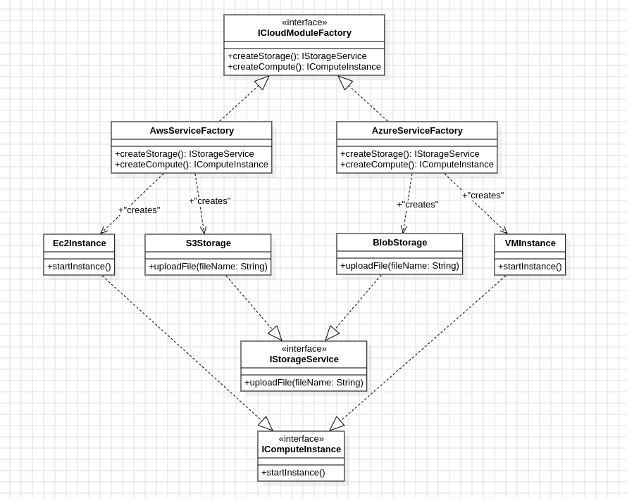

# LP5_AbstractFactory

Neste projeto, implementei um sistema de gestão de serviços de nuvem que abstrai os específicos de cada provedor (AWS e Azure como exemplo) utilizando o padrão Abstract Factory.

## Diagrama de Classe

